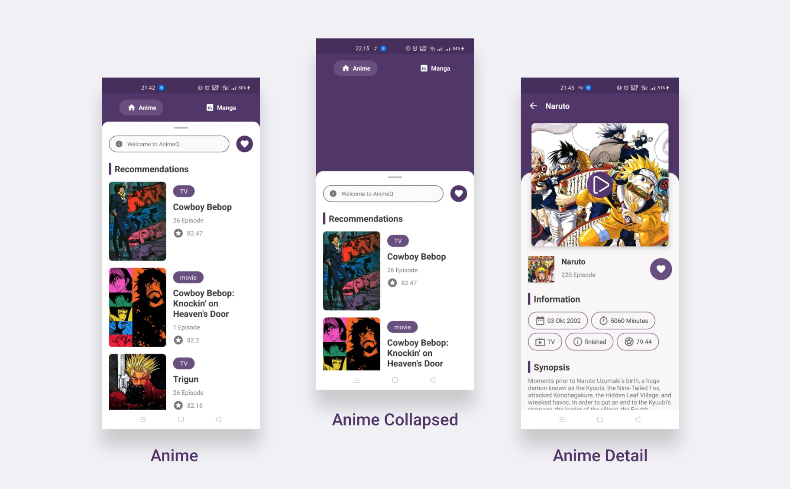
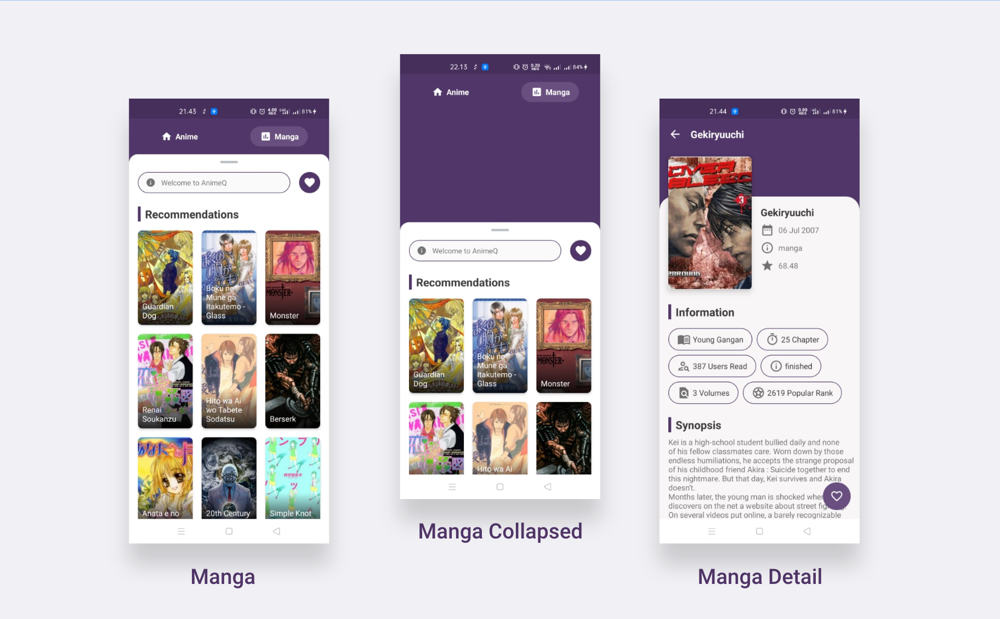
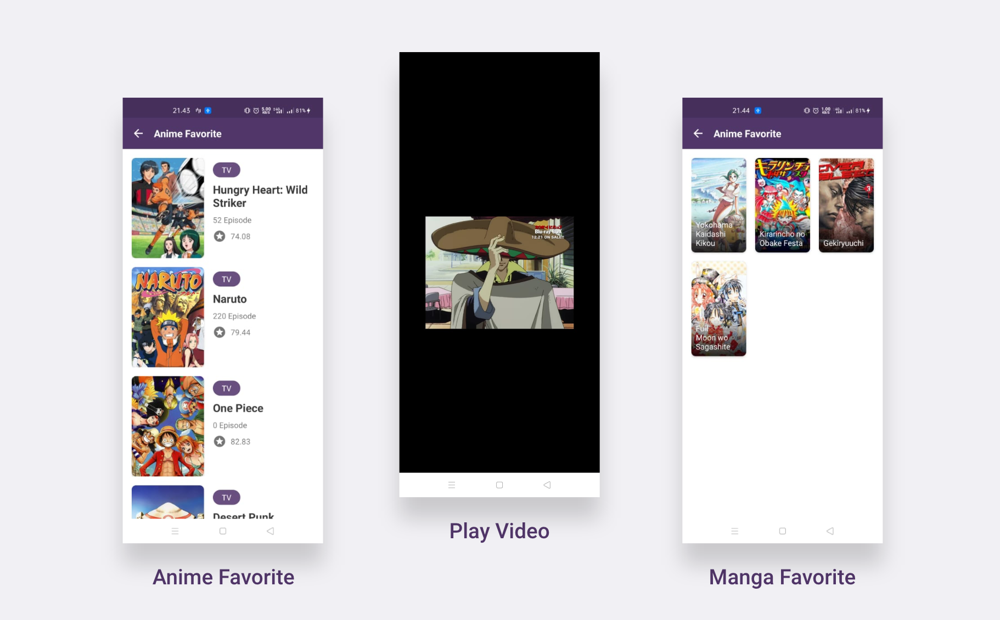

# AnimeQ

AnimeQ merupakan aplikasi Project Submission Dicoding dari Kelas Menjadi Android Developer Expert

### Continuous Integration

### App Features
* **List Anime** - yang menampilkan daftar anime terbaru
* **List Manga** - yang menampilkan daftar manga terbaru
* **Anime Favorite** - yang menampilkan daftar anime yang sudah ditambahkan sebagai favorite
* **Manga Favorite** - yang menampilkan daftar manga yang sudah ditambahkan sebagai favorite

 

 

 
Screenshot

 

  

 
Screenshot

 

   

 
Screenshot

 

 

 
 <h1>Creator</h1>
 
AnimeQ created by [wahyouwebid](http://github.com/wahyouwebid)

 
You can contact me at : hallo@wahyou.web.id

 <h1>License</h1>
 
AnimeQ Apps is under the [GPL3 License](LICENSE)

