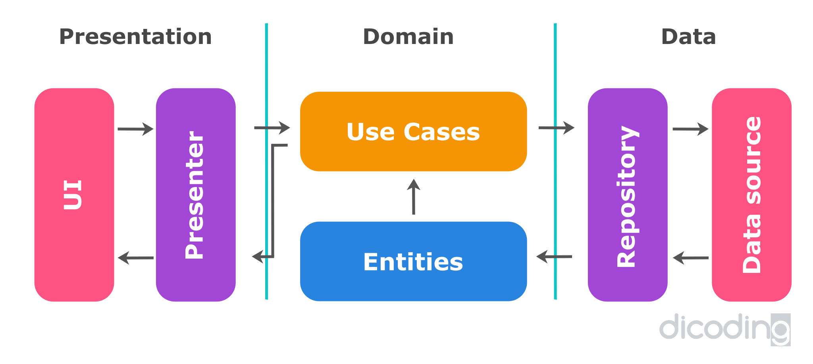
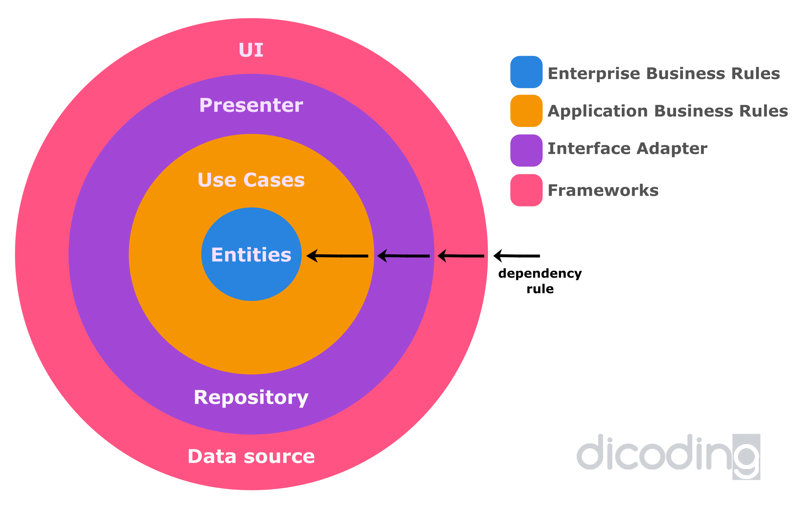

# AnimeQ

AnimeQ merupakan aplikasi Project Submission Dicoding dari Kelas Menjadi Android Developer Expert


### Continuous Integration

[](https://app.codacy.com/gh/wahyouwebid/AnimeQ?utm_source=github.com&utm_medium=referral&utm_content=wahyouwebid/AnimeQ&utm_campaign=Badge_Grade_Settings)
[](https://circleci.com/gh/wahyouwebid/AnimeQ)

### Code Quality
[](https://www.codacy.com/gh/wahyouwebid/AnimeQ/dashboard?utm_source=github.com&amp;utm_medium=referral&amp;utm_content=wahyouwebid/AnimeQ&amp;utm_campaign=Badge_Grade)


### App Features
* **List Anime** - menampilkan daftar anime terbaru
* **List Manga** - menampilkan daftar manga terbaru
* **Anime Favorite** - menampilkan daftar anime yang sudah ditambahkan sebagai favorite
* **Manga Favorite** - menampilkan daftar manga yang sudah ditambahkan sebagai favorite

### API
Api yang digunakan dalam project ini yaitu https://kitsu.io

Base URL yang digunakan adalah sebagai berikut
```
https://kitsu.io
```

#### Endoint Used

|Method | Endpoint | Usage |
| ---- | ---- | --------------- |
|GET| `api/edge/anime` or `/anime?page[limit]=5&page[offset]=0` | Get All Anime|
|GET| `api/edge/manga` or `/manga?page[limit]=5&page[offset]=0` | Get All Manga.| 

### Architectures

<p align="center"></p>
<p align="center"></p>

### Screenshot
<span align="center">
 <hr>
 <p align="center"></p>
 <p align="center">Screenshot</p>
 <hr>
  <p align="center"></p>
 <p align="center">Screenshot</p>
 <hr>
   <p align="center"></p>
 <p align="center">Screenshot</p>
 <hr>
 </span>


<br>
 <h1>Creator</h1>
 <p>AnimeQ created by [wahyouwebid](http://github.com/wahyouwebid)</p>
 <p>You can contact me at : hallo@wahyou.web.id</p>
 <h1>License</h1>
 <p>AnimeQ Apps is under the [GPL3 License](LICENSE)</p>
